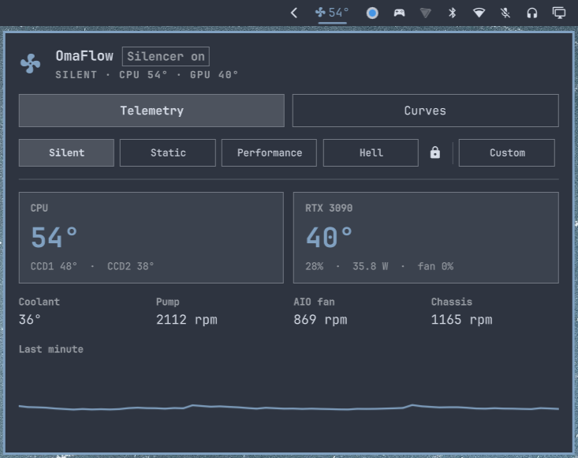
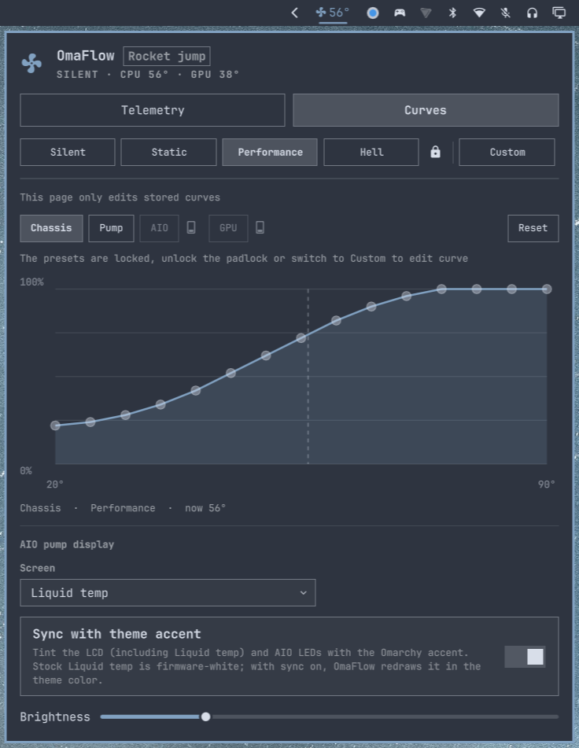
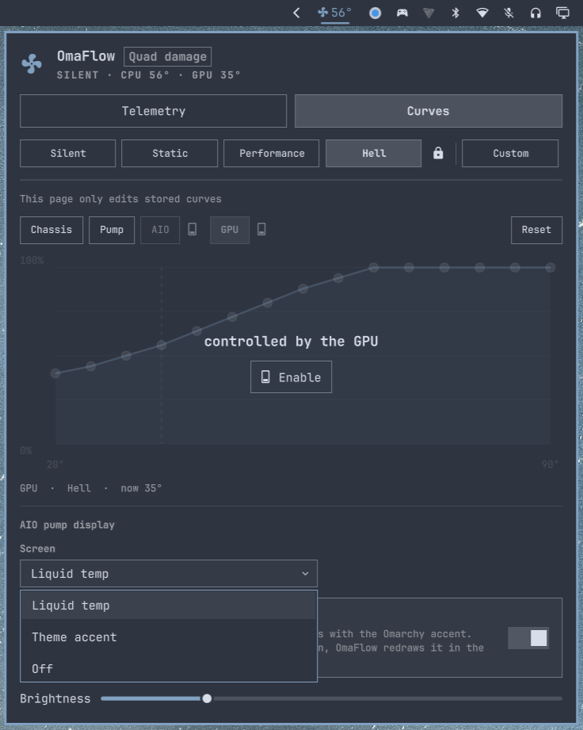

# OmaFlow

Fan, pump, and AIO control from the [Omarchy](https://omarchy.org/) bar. Chassis fans through [fan2go](https://github.com/markusressel/fan2go), NVIDIA GPU fans through `nvidia-settings` (off until you enable them), AIO pump / radiator / LCD through [liquidctl](https://github.com/liquidctl/liquidctl). Same modes on both tabs, no separate panel for the pump.







## Compatible version

**Omarchy 4** (Quattro shell). Tested on Omarchy `4.0.4`.

## Dependencies

OmaFlow needs these to *apply* curves. Telemetry (CPU/GPU/coolant temps, RPM) works without them.

| Package | Role |
| --- | --- |
| [liquidctl](https://github.com/liquidctl/liquidctl) | AIO pump, radiator, LCD |
| [fan2go](https://github.com/markusressel/fan2go) | Chassis / motherboard PWM fans |
| `nvidia-settings` | GPU fans, only after you enable GPU on Settings |
| Python 3 | Already on Omarchy. Pillow is used to draw a tinted liquid-temp LCD |

Open the widget the first time and press **Install dependencies**. That runs `setup` in a floating terminal (sudo once): liquidctl from the Omarchy package set, a polkit helper, and the fan2go systemd unit.

Install **fan2go yourself** so `/usr/bin/fan2go` is the packaged binary. Setup does not download it and does not build it from the AUR. Chassis PWM still works through the helper if the package is not installed yet; run setup again after installing fan2go to enable the service.

If the cooler uses motherboard headers instead of USB (a one-cable Arctic-style AIO, or no AIO at all), press **Install fan control only**. That installs the helper and skips liquidctl.

`omarchy plugin add` never runs package managers or sudo. The setup script is the only step that asks for a password.

You can run the same script later:

```bash
~/.config/omarchy/plugins/tempest-chaoscreator.omaflow/setup
```

## Hardware

### Tested on

This machine:

| Role | Brand | Model |
| --- | --- | --- |
| CPU | AMD | Ryzen 9 5950X |
| GPU | NVIDIA | GeForce RTX 3090 Founders Edition |
| Motherboard | ASUS | ROG Crosshair VIII Dark Hero |
| AIO | NZXT | Kraken Z53 (LCD pump) |
| Fan hub | NZXT | Smart Device V2 |

AIO radiator fans on this build sit on an NZXT PWM hub into a motherboard header, not the Kraken fan header — so AIO fan control stays off unless you enable it.

### Supported (by backend)

<details>
<summary>NVIDIA</summary>

GPU fan control through `nvidia-settings` after you enable **GPU** on Settings. Zero-RPM idle (RTX 30-series Founders, and similar) is handed back to NVIDIA auto when the curve is 0%. Telemetry uses `nvidia-smi`.

- GeForce RTX 20 / 30 / 40 series
- GeForce GTX 16 series and newer with working `nvidia-settings` fan control
</details>

<details>
<summary>AMD</summary>

CPU package / CCD temps through `k10temp` (Ryzen). Chassis fans through any hwmon PWM device fan2go can see. No AMD GPU fan control in this release (telemetry only if the driver exports hwmon).

- Ryzen 3000 / 5000 / 7000 desktop (k10temp Tctl / Tccd)
- Board fan headers on ASUS, MSI, Gigabyte, ASRock when they appear as hwmon PWM
</details>

<details>
<summary>Intel</summary>

CPU temps through `coretemp` when present. Chassis fans through fan2go hwmon, same as AMD boards.

- Core i5 / i7 / i9 desktop with `coretemp`
</details>

<details>
<summary>NZXT</summary>

- Kraken Z53 / Z63 / Z73 — pump curve, LCD (liquid / accent / off), optional radiator fans
- Kraken X42 / X52 / X62 / X72 and X53 / X63 / X73 — pump (and fan where the device has one)
- Kraken 2023 / 2024 Standard and Elite — liquidctl LCD + pump
- Smart Device V1 / V2 — chassis fans via the kernel hwmon driver (`nzxtsmart2`)
</details>

<details>
<summary>Corsair</summary>

AIO pump / fan profiles through liquidctl when the device is listed by `liquidctl status`.

- Hydro H100i / H115i / H150i Pro / Elite / XT / Platinum class coolers
- Commander Pro / Core fan hubs if liquidctl exposes them
</details>

<details>
<summary>Other AIOs and hubs</summary>

Anything `liquidctl list` and `fan2go detect` can see. Pump duty is clamped to a 50% floor in every mode.

- MSI MEG / MPG CoreLiquid
- EVGA / NZXT Asetek 690LC units
- Aquacomputer D5 Next and similar liquidctl devices
- Generic motherboard PWM fans (Nuvoton NCT, ITE IT87, ASUS EC, …)
</details>

## Install

```bash
omarchy plugin add https://github.com/tempest-chaoscreator/OmaFlow.git --enable
```

Open the chip, then **Install dependencies** if liquidctl / fan2go are not on the machine yet.

The widget lands on the right of the bar. Move it with:

```bash
omarchy bar move tempest-chaoscreator.omaflow --section right
```

### Remove

```bash
omarchy plugin remove tempest-chaoscreator.omaflow
```

That deletes the plugin folder and its bar entry. liquidctl and fan2go stay installed; drop liquidctl with `omarchy pkg drop liquidctl`, and remove fan2go with the same package manager you used to install it. The helper lives at `/usr/local/lib/omaflow/omaflow-helper`, the unit at `/etc/systemd/system/fan2go.service`, the config at `/etc/fan2go/fan2go.yaml`, and the database at `/var/lib/omaflow/fan2go.db`.

## Using it

| Action | Effect |
| --- | --- |
| Left click the chip | Open / close the panel |
| Right click | Toggle Silent ↔ Performance |
| Middle click | Switch Telemetry / Settings |
| `1`–`5` | Silent, Static, Performance, Hell, Custom |
| `m` / `s` | Telemetry / Settings (`c` still opens Settings) |
| Escape | Close |

**Telemetry** — CPU (Tctl + CCDs), GPU (temp, load, power, fan), coolant, pump, chassis RPM, one-minute sparkline. The mode buttons on this page are the ones that change the live curve.

**Settings** — five modes and an NZXT CAM-style graph. CPU-temperature graphs run 28–98 °C. Liquid-temperature graphs (Pump, AIO, and CPU) run 28–60 °C, which is as hot as coolant should get. GPU stays on 20–90 °C. Drag a handle up and the points to its right come with it. Silent / Static / Performance / Hell share one padlock. Custom is always unlocked. Reset restores only the selected channel. Edits on this tab do not change the live mode; pick that on Telemetry.

Pump, AIO, and CPU each have a curve input: CPU temp or liquid temp. GPU and AIO (and CPU, when a CPU fan header is detected) hide their on/off switch until you select that card. The card grows to show a horizontal switch. CPU stays grey when fan2go sees no CPU fan. The info mark next to Reset explains one-cable AIOs: leave the CPU switch off and let the BIOS run `CPU_FAN`, or split the cable so the pump is on `AIO_PUMP` and the radiator fans are on `CPU_FAN`.

The bottom of Settings exports and imports a JSON file of the stored curves and settings.

GPU, AIO, and the CPU header stay unmanaged until you enable their switches.

| Mode | Fans | Pump |
| --- | --- | --- |
| **Silent** | Low floor, slow ramp | 50% floor, then up with CPU temp |
| **Static** | Flat 50% | Flat 60% |
| **Performance** | Steep ramp | 75% floor, then up |
| **Hell** | High floor, stays aggressive | 75% until warm, then 100% |
| **Custom** | Yours | Yours (still 50% minimum) |

Pump duty never goes below 50% in any mode, including Custom — dragging a pump handle below that floor snaps it back.

AIO LCD:

- **Liquid temp** — coolant readout. With **Sync with theme accent** on, OmaFlow redraws it in the theme color (stock firmware liquid is white).
- **Theme accent** — solid fill of the Omarchy accent.
- **Off** — black screen, brightness 0.

## How it applies

- **fan2go** owns motherboard / NZXT Smart Device chassis fans. The bridge keeps a copy of the curve at `~/.config/omaflow/fan2go.yaml`. The root service does not read that file. It reads `/etc/fan2go/fan2go.yaml`, which the helper republishes after checking the document. The database is `/var/lib/omaflow/fan2go.db`.
- **nvidia-settings** owns GPU fans only after you enable GPU on Settings. A 0% target returns the card to NVIDIA auto so 3090 zero-RPM idle works.
- A detected **CPU fan** header is driven by fan2go only after you enable CPU. Off, that header is left to the BIOS.
- **liquidctl** owns the AIO: pump curve, radiator curve, LCD, optional LEDs. Those profiles live on the device.
- If fan2go is not running yet, the bridge holds chassis PWM itself so the modes still do something after setup.

Telemetry is always available from hwmon and `nvidia-smi`, even before the stack is installed.

## Privileged paths

Setup pins `scripts/omaflow_helper.py` to a SHA-256 in the setup script. It reads that file once, checks the digest, and passes the bytes to a root installer on stdin. The installer does not open the plugin directory. An active local member of `wheel` can run the installed helper without a password. Its commands are fixed: write a PWM value, release a header back to the BIOS, publish a checked curve document, import an existing root-owned fan database once, restart the unit, and check that `/usr/bin/fan2go` is a root-owned binary.

The helper refuses `cmd` and `file` fans, refuses any database path other than `/var/lib/omaflow/fan2go.db`, and binds the API to `127.0.0.1:9001`. The unit sets `ProtectHome` and `PrivateTmp`, so the root daemon cannot read the home directory or `/tmp`.

## License

MIT. See [LICENSE](LICENSE).
